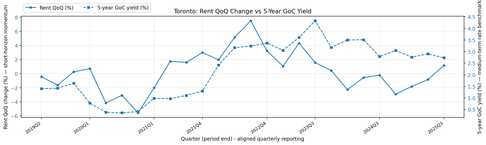
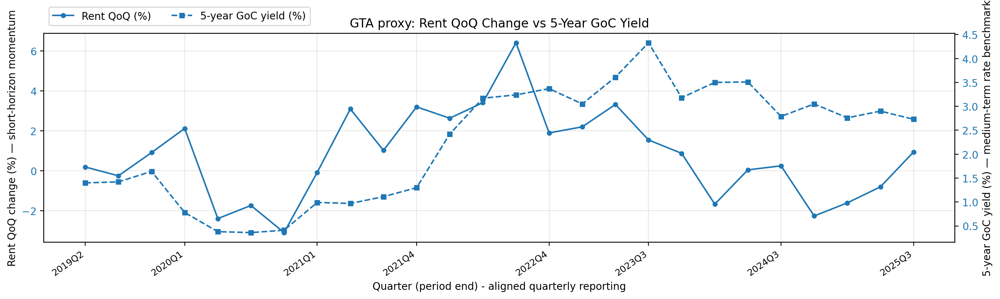

# Canadian Rent & Mortgage Forecasting

This project forecasts Canadian apartment rents and mortgage loans using Statistics Canada data. I built two models: an ElasticNet model for rent forecasts by CMA, and a SARIMAX model for mortgage loans at the Canada level. The data runs from 2019Q1 to 2025Q3. This is a clean, reproducible pipeline with interpretable results.

## Data and Scope

**Rent data:**
- Asking rent in CAD for 1-bedroom and 2-bedroom apartments
- Data is organized by Census Metropolitan Area (CMA), not individual municipalities
- Toronto CMA includes Mississauga, Brampton, Oakville, and Burlington, so those cities don't appear separately
- 41 CMAs total, quarterly data

**Mortgage data:**
- Chartered bank mortgage loans outstanding at Canada level
- Units are in millions (e.g., 1,700,000 means about $1.7 trillion)
- Quarterly data

**Data sources:**
All data comes from Statistics Canada CSV files in `data/raw/`. The pipeline aggregates everything to quarterly:
- Quarterly data uses quarter-end timestamps
- Weekly rates use the last observation in each quarter
- Monthly labour/employment uses quarterly averages
- Monthly housing starts uses quarterly sums

## Rent Model Performance

Rolling backtest: 13 quarters, 1,032 predictions.

| Model | MAE (CAD) | sMAPE (%) |
|-------|-----------|-----------|
| ElasticNet | 42.34 | 2.61% |
| Lag-1 baseline | 44.00 | 2.74% |
| Lag-4 baseline | 117.30 | 7.48% |

Uplift vs Lag-4 baseline: 63.9% MAE improvement, 65.1% sMAPE improvement.

**What this means:**
- MAE is the typical miss in dollars. We're off by about $42 CAD on average.
- sMAPE is the typical miss in percent. We're off by about 2.6% on average.
- Lag-1 baseline means "use last quarter's rent". It's pretty close to our model.
- Lag-4 baseline means "use the same quarter last year". We beat it by a lot.
- The big win: exogenous features (population, migration, housing starts, rates) matter. The seasonal rule isn't enough.

## Mortgage Model Performance

SARIMAX model on quarterly series with 27 observations (2019Q1 to 2025Q3).

- MAE: 19,838 (millions), which is about $19.8 billion
- sMAPE: 1.17%
- 15 predictions in the backtest

**Caveats:**
- Small sample size (27 quarters). The model fits the data but we're working with limited history.
- Scale-free error around 1% is decent for directional forecasting.
- This is aggregate Canada-level data. Regional patterns may differ.

## Findings in Plain English

**Rent:**
- Population growth and migration are the strongest signals. When people move to a CMA, rent goes up.
- Housing starts matter but with a lag. New supply takes 2-3 quarters to hit the market.
- Interest rates have mixed effects. Higher rates reduce investor demand for rental properties, but they also push people away from homeownership, increasing rental demand.
- The ElasticNet model picks up these relationships across 41 CMAs and 2 unit types. It's not just seasonality.

**Toronto and GTA:**
- The data uses CMA boundaries. Toronto CMA includes Mississauga, Brampton, Oakville, and Burlington. They're all grouped as "Toronto" in the dataset.
- This is asking rent (new listings), not existing tenant rent. Asking rent moves faster.
- The GTA proxy chart aggregates Toronto and Oshawa CMAs. It's an approximation, not the full GTA.

**Mortgages:**
- SARIMAX fits because mortgage loans are a time series with seasonality and rate sensitivity.
- The model shows strong rate sensitivity with a 1-2 quarter transmission lag.
- Credit conditions and employment matter, but rates are the main driver.

## Key Charts

### Rent Forecasts


**Toronto 1-Bedroom Rent Forecast**
- Actual vs predicted asking rent in CAD, quarterly from 2019Q1 to 2025Q3
- Includes baseline comparisons (Lag-1 and Lag-4) to show model value
- Look at: how well the model tracks actual movements during rate cycles and migration surges
- Takeaway: the model beats the seasonal baseline consistently


**GTA Proxy 1-Bedroom Rent Forecast**
- Aggregates Toronto and Oshawa CMAs (mean) to approximate GTA dynamics
- Same structure as Toronto chart: actual vs predicted vs baselines
- Look at: regional trends beyond core Toronto
- Takeaway: broader GTA shows similar patterns to Toronto

### Model Performance


**Model Improvement vs Seasonal Baseline**
- sMAPE improvement in percent, by CMA and unit type
- Green means large improvement, red/yellow means smaller improvement
- Look at: which markets and unit types benefit most from exogenous features
- Takeaway: most CMAs show positive uplift, meaning the model adds value beyond seasonality


**Top 15 CMAs by Model Improvement**
- Ranks CMAs by average uplift (across unit types) vs Lag-4 baseline
- Horizontal bars show sMAPE improvement percentage
- Look at: markets where demand/supply dynamics are most predictable
- Takeaway: higher uplift means the model adds more value relative to naive seasonality

### Rate Story



**Toronto Rent QoQ Change vs 5-Year GoC Yield**
- Dual-axis plot: rent quarter-over-quarter change in percent vs 5-year Government of Canada bond yield in percent
- Quarterly data aligned to period-end dates
- Look at: short-horizon rent momentum and its relationship to medium-term rate expectations
- Takeaway: QoQ changes are volatile, but there's correlation with rate expectations



**GTA Proxy Rent QoQ Change vs 5-Year GoC Yield**
- Same structure as Toronto chart, aggregates Toronto and Oshawa CMAs
- Look at: whether broader GTA shows similar rate sensitivity
- Takeaway: proxy aggregate shows similar patterns to Toronto

### Mortgage Forecast


**Chartered Bank Mortgage Loans Outstanding**
- Actual vs predicted mortgage loans outstanding in CAD billions, Canada level, quarterly
- SARIMAX model with exogenous regressors (rates, credit conditions, employment)
- Look at: how well the model captures rate transmission effects
- Takeaway: the model tracks the credit cycle reasonably well given the small sample

## How to Run

```bash
# Create virtual environment
python -m venv .venv
source .venv/bin/activate  # On Windows: .venv\Scripts\activate

# Install dependencies
pip install -r requirements.txt

# Run the pipeline
python run_pipeline.py

# Build figures for README
python scripts/build_figures.py
```

The pipeline will:
1. Preprocess rent and mortgage targets
2. Build exogenous features
3. Create modeling datasets
4. Train and backtest both models
5. Generate plots

## Outputs

All outputs are saved to `outputs/`:

**Predictions:**
- `rent_predictions.csv`: Rent forecasts with actual vs predicted
- `mortgage_predictions.csv`: Mortgage forecasts with actual vs predicted

**Metrics:**
- `rent_metrics.json`: MAE and sMAPE overall and by unit type
- `mortgage_metrics.json`: MAE and sMAPE for mortgage forecasts

**Model Details:**
- `rent_model_coefficients.csv`: ElasticNet feature coefficients
- `mortgage_model_summary.txt`: SARIMAX model summary

**Plots** (in `outputs/plots/`):
- Plotly charts in `outputs/plots/plotly/`
- Matplotlib evaluation charts in `outputs/plots/mpl_eval/`
- Matplotlib story charts in `outputs/plots/mpl_story/`
- Mortgage forecast in `outputs/plots/mortgage_actual_vs_predicted.png`

**Processed Data** (in `data/processed/`):
- `mortgage_target_quarterly.parquet`: Mortgage target series
- `rent_target_quarterly.parquet`: Rent target series
- `exog_quarterly.parquet`: Exogenous features
- `rent_model_dataset.parquet`: Rent modeling dataset
- `mortgage_model_dataset.parquet`: Mortgage modeling dataset

## Q1 2026 Consensus Outlook

This outlook is based on model outputs, observed trends through 2025Q3, and structural relationships in the data. It's qualitative, not point forecasts.

### Rates

**Base Case:**
- Bank rate likely holds or eases modestly from current levels, conditional on inflation data
- 5-year GoC yield reflects market expectations for gradual easing, remains sensitive to inflation surprises
- Key drivers: inflation persistence, labour market tightness, housing market stability
- Rate transmission to mortgages operates with 1-2 quarter lag

**Upside Case:** Faster disinflation allows earlier cuts, supporting mortgage growth and rental demand

**Downside Case:** Inflation re-accelerates or housing stress intensifies, forcing higher-for-longer policy

### Mortgages

**Base Case:**
- Growth likely remains subdued or slightly negative in Q1 2026, reflecting rate sensitivity and lagged effects
- Housing demand proxies (population growth, migration) remain supportive but rate headwinds persist
- Credit conditions tighten further if rates stay elevated, loosening if cuts materialize
- SARIMAX model shows strong rate sensitivity with 1-2 quarter transmission lag

**Upside Case:** Rate cuts materialize, unlocking pent-up demand and accelerating mortgage growth

**Downside Case:** Prolonged high rates or housing market stress leads to further credit contraction

### Rent

**Base Case:**
- 1-bedroom asking rent: moderate upward pressure continues, driven by population growth and migration inflows
- 2-bedroom asking rent: similar direction but potentially less pressure than 1-bedroom (supply/demand balance)
- Housing starts lag effects: recent starts will add supply with 2-3 quarter delay, but demand growth may outpace
- Rate effects: higher rates reduce investor demand for rental properties but also reduce homeownership, increasing rental demand
- ElasticNet model shows strong signals from migration and population growth, rate effects are mixed

**Upside Case:** Migration surge continues, housing starts lag, rates ease (supporting demand), leading to stronger rent growth

**Downside Case:** Migration slows, housing starts accelerate, rates stay high (reducing demand), leading to flat or declining rents

**Important Limitations:**
- Data covers CMA boundaries (Toronto CMA includes Mississauga, Brampton, etc.)
- This is asking rent (new listings), not existing tenant rent (which adjusts more slowly)
- Regional variations within GTA are not captured by CMA-level aggregation
