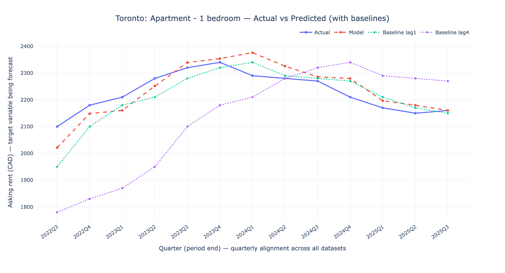
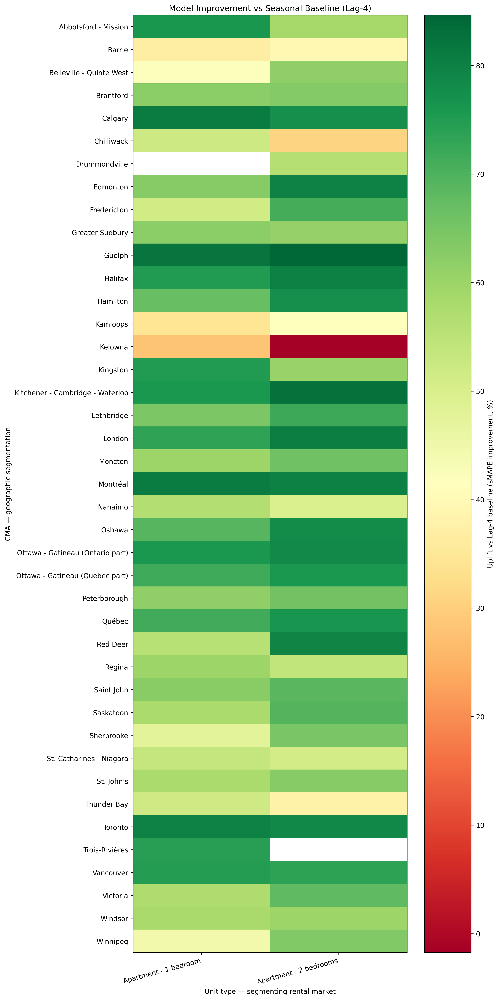
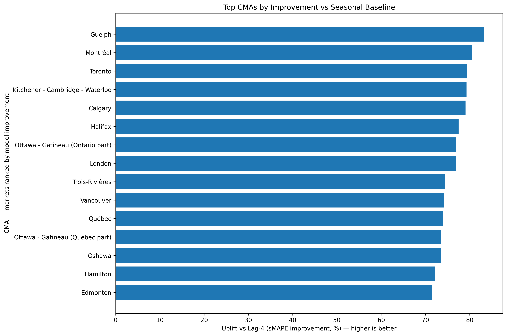
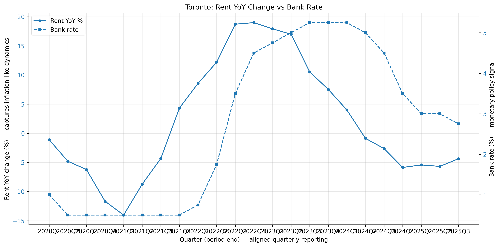
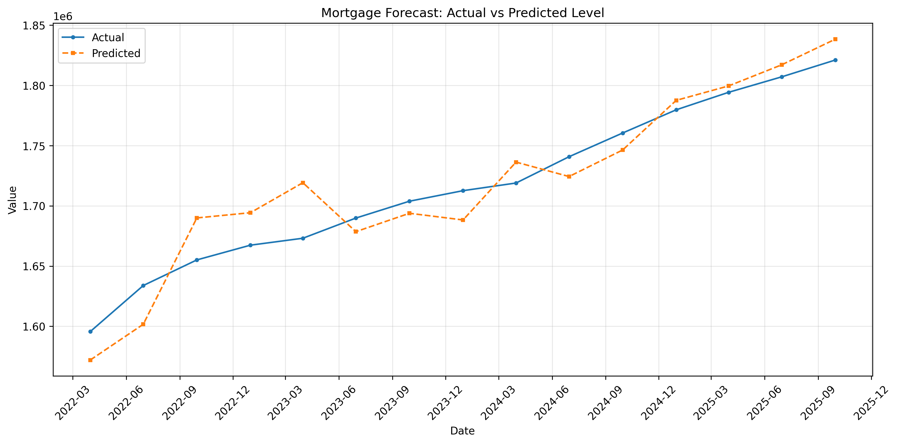

# Canadian Rent & Mortgage Forecasting

This repository forecasts Canadian apartment rents and mortgage loans using Statistics Canada data. The models capture how rent pressure is driven by demand (population growth, migration), supply constraints (housing starts with lag), and interest rates. The mortgage module shows rate transmission and credit conditions.

## Headline Metrics

**Rent Model Performance** (Rolling backtest: 13 quarters, 1,032 predictions):

| Model | MAE (CAD) | sMAPE (%) |
|-------|-----------|-----------|
| **ElasticNet** | 42.34 | **2.61%** |
| Lag-1 baseline | 44.00 | 2.74% |
| Lag-4 baseline | 117.30 | 7.48% |

**Uplift vs Lag-4 baseline**: 63.9% MAE improvement, 65.1% sMAPE improvement

The ElasticNet model outperforms both naive baselines, with particularly strong gains over the seasonal (Lag-4) baseline, demonstrating the value of incorporating exogenous features (population, migration, housing starts, interest rates).

## Toronto & GTA Focus

This project focuses on Toronto and the Greater Toronto Area (GTA) for detailed analysis and visualization. **Important note**: The data uses Census Metropolitan Area (CMA) boundaries. Cities like Mississauga, Brampton, Oakville, and Burlington are part of the Toronto CMA, so they appear as "Toronto" in the dataset rather than as separate municipalities.

## The Story

**Rent Model**: Rent pressure comes from three main forces:
- **Demand**: Population growth and international migration increase housing demand
- **Supply lag**: Housing starts take time to become available units, creating supply constraints
- **Rates**: Interest rates affect both rental demand and investment in rental properties

**Mortgage Model**: Tracks how interest rates transmit through the financial system to mortgage lending, showing credit conditions and borrowing patterns.

## Data Sources

All data comes from Statistics Canada CSV extracts saved locally in `data/raw/`:

| File | StatCan Table ID | Description | Frequency |
|------|------------------|-------------|-----------|
| `4610009201-noSymbol.csv` | 46-10-0092-01 | Asking rent prices | Quarterly |
| `1010013401-noSymbol.csv` | 10-10-0134-01 | Chartered banks mortgage loans | Quarterly |
| `3810023801-noSymbol.csv` | 38-10-0238-01 | Household credit market summary | Quarterly |
| `1010014501-noSymbol.csv` | 10-10-0145-01 | Financial market statistics | Weekly |
| `1410028701-noSymbol.csv` | 14-10-0287-01 | Labour force characteristics | Monthly |
| `1410032001-noSymbol.csv` | 14-10-0320-01 | Monthly employees count | Monthly |
| `34100156.csv` | 34-10-0156 | Housing starts | Monthly |
| `17100009.csv` | 17-10-0009 | Population estimates | Quarterly |
| `17100040.csv` | 17-10-0040 | International migration components | Quarterly |
| `17100121.csv` | 17-10-0121 | Non-permanent residents | Quarterly |

## Aggregation Rules

All data is aggregated to quarterly for modeling:

- **Quarterly data**: Use quarter-end Timestamp
- **Weekly rates**: Take last observation in quarter (quarter-end value)
- **Monthly labour/employment**: Use quarterly average
- **Monthly housing starts**: Use quarterly sum
- **Quarterly population/migration**: Use directly

## Models

**Rent Model (Elastic Net)**: Forecasts asking rents for 1-bedroom and 2-bedroom apartments by CMA. Uses lagged rents, exogenous features (population, migration, starts, rates), and seasonality.

**Mortgage Model (SARIMAX)**: Forecasts chartered bank mortgage loans at Canada level. Uses SARIMAX with exogenous regressors (rates, credit conditions, employment).

## Running the Pipeline

```bash
# Install dependencies
pip install -r requirements.txt

# Run the complete pipeline
python run_pipeline.py
```

The pipeline will:
1. Create output directories
2. Preprocess targets (rent and mortgage)
3. Build exogenous features
4. Create modeling datasets
5. Train and backtest both models
6. Generate plots

## Outputs

All outputs are saved to `outputs/`:

**Predictions**:
- `rent_predictions.csv`: Rent forecasts with actual vs predicted
- `mortgage_predictions.csv`: Mortgage forecasts with actual vs predicted

**Metrics**:
- `rent_metrics.json`: MAE and sMAPE overall and by unit type
- `mortgage_metrics.json`: MAE and sMAPE for mortgage forecasts

**Model Details**:
- `rent_model_coefficients.csv`: Elastic Net feature coefficients
- `mortgage_model_summary.txt`: SARIMAX model summary

**Plots** (in `outputs/plots/`):
- `rent_overall.png`: Overall rent forecast
- `rent_by_unit_type.png`: Rent forecast by unit type
- `rent_top_cmas.png`: Rent forecast for top 6 CMAs
- `mortgage_actual_vs_predicted.png`: Mortgage forecast

**Processed Data** (in `data/processed/`):
- `mortgage_target_quarterly.parquet`: Mortgage target series
- `rent_target_quarterly.parquet`: Rent target series (if available)
- `exog_quarterly.parquet`: Exogenous features
- `rent_model_dataset.parquet`: Rent modeling dataset
- `mortgage_model_dataset.parquet`: Mortgage modeling dataset

## Evaluation

Models are evaluated using rolling backtest (expanding window):
- Train on all data up to time t
- Forecast t+1 (and optionally t+2)
- Calculate MAE and sMAPE metrics

**Backtest Coverage**: 13 quarters (Q3 2022 - Q3 2025), 1,032 predictions across 41 CMAs and 2 unit types.

Metrics are reported overall and broken down by unit type (for rent) and forecast horizon.

## Visualizations

### Rent Forecasts: Toronto & GTA




### Model Performance Analysis





### Rate Story



### Mortgage Forecast



